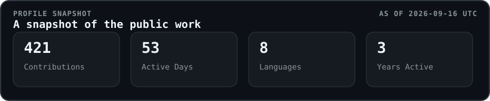

  <table>
    <tr>
      <td width="285" valign="top" align="center">
        
        <h1>Kazi Islam</h1>
        
<code>@Ihthos</code>

        
CS @ Hunter College AI/ML · LLM systems · software engineering

        
📍 New York City

        

          <a href="https://kaziislam.ihthos.dev">Website</a> ·
          <a href="https://www.linkedin.com/in/kazi-islam0/">LinkedIn</a> ·
          <a href="https://github.com/Ihthos">Repositories</a>
        

      </td>
      <td width="720" valign="top">
        
         
        
      </td>
    </tr>
  </table>

<h2 align="center">Featured projects</h2>

<table>
  <tr>
    <td width="50%" valign="top">
      <h3><a href="https://github.com/Ihthos/dsv4-flash-ikllama">DeepSeek-V4 Flash local inference</a></h3>
      
Reproducible <code>ik_llama.cpp</code> recipe for running a 284B MoE model on RTX 3090 + Ryzen AI MAX+ 395 hardware.

      C++ · CUDA · Vulkan
    </td>
    <td width="50%" valign="top">
      <h3><a href="https://github.com/Ihthos/CUNYRMP">CUNYRMP</a></h3>
      
Chrome MV3 extension that brings Rate My Professors context into CUNY Schedule Builder while students plan classes.

      JavaScript · Chrome Extensions · CUNY
    </td>
  </tr>
  <tr>
    <td width="50%" valign="top">
      <h3><a href="https://github.com/Ihthos/potholeiq-api">PotholeIQ API</a></h3>
      
FastAPI backend for NYC pothole risk, reports, alerts, and model-backed civic data workflows.

      Python · FastAPI · APIs
    </td>
    <td width="50%" valign="top">
      <h3><a href="https://github.com/Ihthos/potholeiq-frontend">PotholeIQ Frontend</a></h3>
      
React + Vite interface for map and list exploration, filtering, and PotholeIQ API integration.

      TypeScript · React · Vite
    </td>
  </tr>
</table>

<h2>Engineering focus</h2>

I build practical software across local AI inference, applied machine learning, education, and civic data tools. My current toolkit is:

`Python` · `FastAPI` · `C++` · `CUDA` · `Vulkan` · `React` · `TypeScript` · `Cloudflare Workers`

The [Socratic AI Homework Helper](https://github.com/ihthos0-art/tutions) is maintained under a second GitHub identity.

Profile statistics and contribution art are generated from GitHub's public profile data and refreshed daily by GitHub Actions.
