  <h3><code>kazi@github ~ $ ./contributions.sh</code></h3>
  

    

  <table>
    <tr>
      <td valign="top" width="370">
        <h3><code>kazi@github ~ $ whoami</code></h3>
        
I build practical software across local AI inference, applied machine learning, education, and civic data tools.

        
<a href="https://github.com/Ihthos">GitHub</a>

      </td>
      <td valign="top" width="490"></td>
    </tr>
  </table>

## Selected work

- [PotholeIQ API](https://github.com/Ihthos/potholeiq-api) — FastAPI backend for NYC pothole risk, reports, alerts, and model-backed data workflows.
- [PotholeIQ Frontend](https://github.com/Ihthos/potholeiq-frontend) — React + Vite interface with map/list exploration, filters, and API integration.
- [DeepSeek-V4 Flash local inference](https://github.com/Ihthos/dsv4-flash-ikllama) — reproducible `ik_llama.cpp` recipe for a 284B MoE model on RTX 3090 + Ryzen AI MAX+ 395 hardware.
- [CUNYRMP](https://github.com/Ihthos/CUNYRMP) — Chrome MV3 extension that surfaces Rate My Professors context inside CUNY Schedule Builder.

## Current toolkit

`Python` · `FastAPI` · `C++` · `CUDA` · `Vulkan` · `React` · `TypeScript` · `Cloudflare Workers`

## Other public work

The [Socratic AI Homework Helper](https://github.com/ihthos0-art/tutions) is maintained under a second GitHub identity.

Contribution art is generated from GitHub's public contribution calendar and refreshed daily by GitHub Actions.
