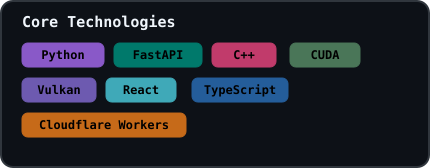
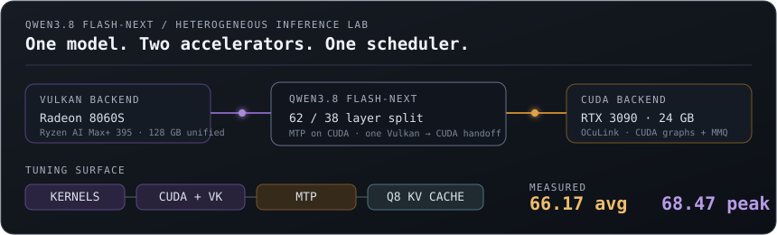

  <h2>Welcome to my GitHub hub</h2>
  
Open-source work across local AI inference, applied ML, education, and civic data.

  

## Tech Stack & Languages

<table>
  <tr>
    <td width="50%" valign="top">
      
    </td>
    <td width="50%" valign="top" align="center">
      
    </td>
  </tr>
</table>

## Notable Projects

<table>
  <tr>
    <td width="50%" valign="top">
      <h3><a href="https://github.com/Ihthos/qwen38-flash-next-inference">Qwen3.8 Flash-Next · Heterogeneous Inference Lab</a></h3>
      
My strongest systems project: a Qwen3.8 Flash-Next serving stack tuned across an RTX 3090 over OCuLink and a Radeon 8060S on Ryzen AI Max+ 395.

      CUDA + Vulkan · MTP · 66.17 tok/s average · 68.47 tok/s peak
    </td>
    <td width="50%" valign="top">
      <h3><a href="https://github.com/Ihthos/CUNYRMP">CUNYRMP</a></h3>
      
Chrome MV3 extension that surfaces Rate My Professors context inside CUNY Schedule Builder.

      JavaScript · 2 stars · 0 forks
    </td>
  </tr>
  <tr>
    <td width="50%" valign="top">
      <h3><a href="https://github.com/Ihthos/potholeiq-api">potholeiq-api</a></h3>
      
FastAPI backend for NYC pothole risk, reports, alerts, and civic data workflows.

      Python · 0 stars · 0 forks
    </td>
    <td width="50%" valign="top">
      <h3><a href="https://github.com/Ihthos/potholeiq-frontend">potholeiq-frontend</a></h3>
      
React + Vite interface for map and list exploration, filters, and API integration.

      TypeScript · 0 stars · 0 forks
    </td>
  </tr>
</table>

The [Socratic AI Homework Helper](https://github.com/ihthos0-art/tutions) is maintained under a second GitHub identity.

## Inference Lab

  

I designed and benchmarked the heterogeneous runtime: a 62/38 layer split, Vulkan-to-CUDA placement, CUDA-side multi-token prediction, FlashAttention, quantized KV cache, and backend-specific tuning. The reported result is from a deterministic 256-token decode benchmark; it is a benchmark result, not a universal throughput guarantee.

Stats, language distribution, and contribution art are generated from GitHub public data and refreshed daily.
